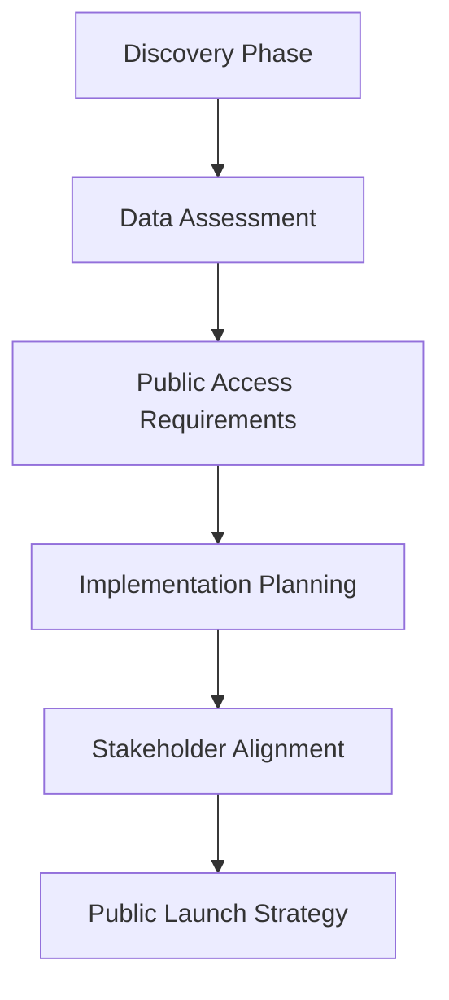
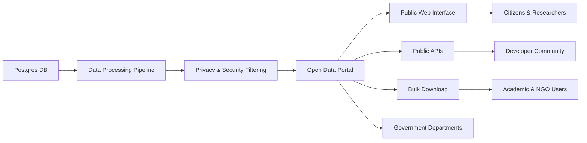
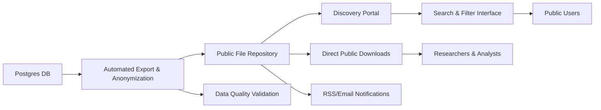
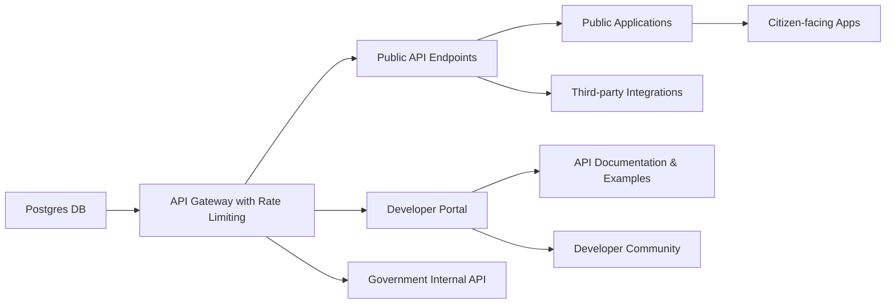
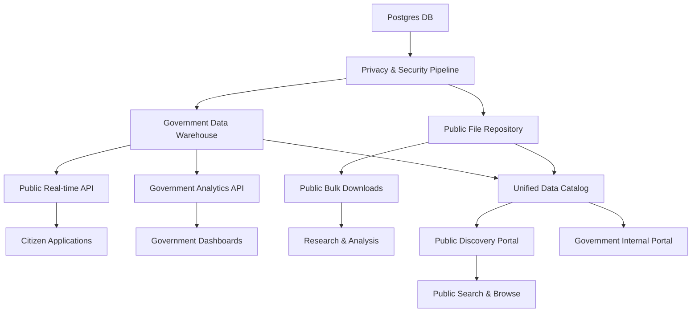
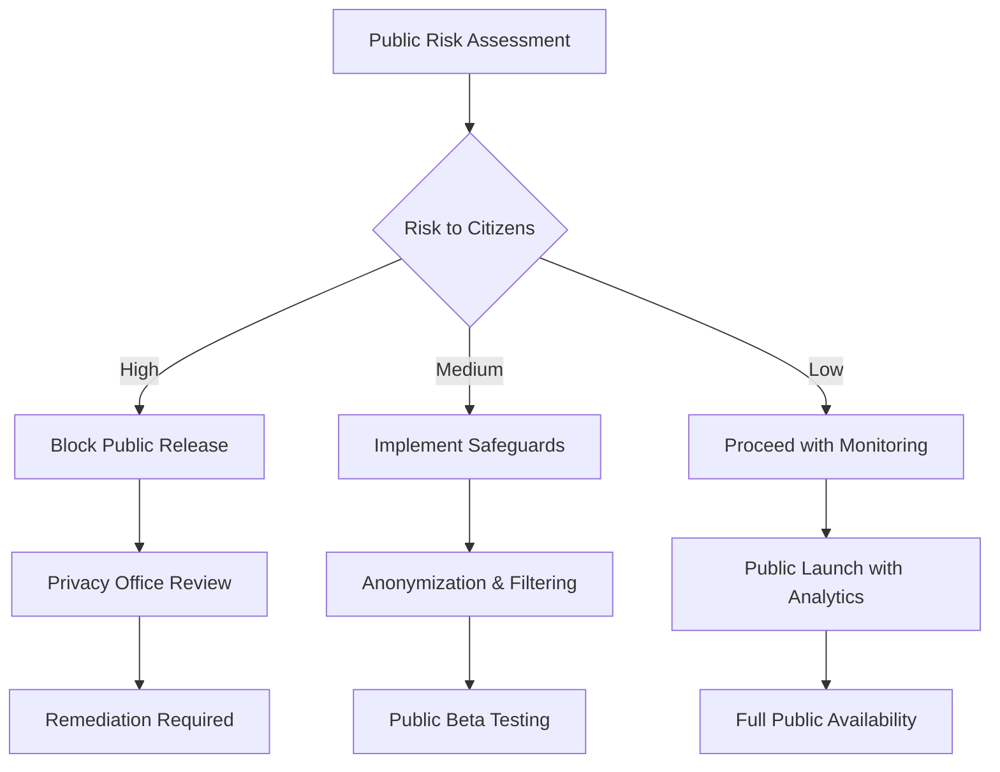

# Public Data Sharing Implementation Guide

## Meeting with Data Provider: Making Postgres Database Publicly Accessible

**Objective:** Transform your database into a discoverable and freely accessible public resource for government
departments and the general public

---

## Agenda Overview



---

## 1. Discovery Phase: Information Gathering

### Critical Information to Obtain

#### Data Structure & Content

- **Database schema documentation**
    - Table structures, relationships, and constraints
    - Data types and field definitions
    - Primary/foreign key relationships
- **Data volume and growth patterns**
    - Current database size
    - Historical growth trends
    - Expected future scaling needs
- **Data refresh frequency**
    - How often is data updated?
    - Real-time vs. batch processing requirements

#### Business Context

- **Data ownership and stewardship**
    - Who is responsible for data quality?
    - Who can authorize data sharing decisions?
- **Use cases and intended audience**
    - **Primary:** Public access and open data consumers
    - **Secondary:** Internal government departments
    - **Target Users:** Citizens, researchers, developers, journalists, advocacy groups
    - **Access Methods:** Web portals, APIs, bulk downloads
- **Data sensitivity classification & public readiness**
    - **Public information** (safe for open access)
    - **Restricted data** (requires anonymization/redaction)
    - **Confidential data** (must be excluded from public sharing)
    - **Personal information (PI)** (requires privacy protection measures)

---

## 2. Public Data Cataloging Requirements

### Essential Metadata for Public Discovery

```
Public Data Catalog
├── Technical Metadata
│   ├── Data Types & Formats
│   ├── Field Descriptions (Plain Language)
│   ├── Data Quality Indicators
│   ├── Update Frequency & Schedule
│   └── API Endpoints & Access Methods
├── Public-Facing Metadata
│   ├── Dataset Title & Description
│   ├── Keywords & Tags
│   ├── Open Data License (CC, OGL, etc.)
│   ├── Usage Examples & Tutorials
│   ├── Contact Information
│   └── Feedback Mechanisms
├── Business Context
│   ├── Purpose & Intended Use
│   ├── Data Collection Methods
│   ├── Limitations & Caveats
│   ├── Related Datasets
│   └── Success Stories
└── Compliance & Governance
    ├── Privacy Assessment Status
    ├── Data Classification Level
    ├── Retention Schedule
    ├── Access Logs (Public Stats)
    └── Quality Assurance Results
```

### Public Data Dictionary Components

- **Citizen-friendly documentation**
    - Plain language explanations (no technical jargon)
    - Real-world examples and use cases
    - Visual data samples and previews
- **Open data standards compliance**
    - DCAT (Data Catalog Vocabulary) metadata
    - Schema.org structured data
    - W3C accessibility guidelines
- **Public engagement features**
    - User rating and feedback systems
    - Download statistics and usage metrics
    - Community-contributed examples

---

## 3. Public Data Sharing Implementation Options

### Option 1: Government Open Data Portal Integration



#### Detailed Analysis

**Technical Requirements:**

- Privacy-preserving data processing pipeline
- Open data compliance tools (DCAT metadata generation)
- Public-facing web portal with search and discovery
- RESTful APIs with documentation and examples
- Multi-format export capabilities (CSV, JSON, XML)
- Automated privacy and security scanning

**Timeline:** 8-12 weeks

**Pros:**

- Maximum public visibility and discoverability
- Compliance with open government initiatives
- Professional presentation with government branding
- Built-in privacy and security safeguards
- Comprehensive usage analytics and feedback
- Integration with existing government data ecosystem

**Cons:**

- Requires extensive privacy review and approval process
- Higher security and compliance overhead
- Limited flexibility for complex data relationships
- Potential performance impact from high public usage

**Best For:** High-value public datasets, government transparency initiatives, datasets with broad public interest

### Option 2: Public File Repository with Discovery Portal



#### Detailed Analysis

**Technical Requirements:**

- Automated data export with privacy filtering
- Public cloud storage (with CDN for global access)
- User-friendly discovery portal with public search
- Multiple format generation (CSV, Excel, JSON)
- Public notification systems for updates
- Basic analytics for public usage tracking

**Timeline:** 3-4 weeks

**Pros:**

- Fastest path to public availability
- Familiar download format for general public
- Low cost and minimal infrastructure
- Easy to communicate data updates to public
- Suitable for non-technical users (Excel, CSV)
- Can handle high download volumes efficiently

**Cons:**

- Limited real-time access for public users
- Basic discovery and search capabilities
- Manual processes for updates
- Less sophisticated public engagement features
- Potential bandwidth costs for popular datasets

**Best For:** Static public datasets, budget-conscious implementations, datasets suitable for offline analysis

### Option 3: Public API with Developer Portal



#### Detailed Analysis

**Technical Requirements:**

- Public REST API with comprehensive documentation
- Developer portal with registration and API keys
- Rate limiting and usage analytics for public access
- Interactive API explorer and code examples
- Caching layer to protect database from public load
- Privacy filtering at the API level

**Timeline:** 6-8 weeks

**Pros:**

- Real-time public data access
- Enables innovation through developer community
- Modern integration approach for tech-savvy users
- Scalable architecture for growing public demand
- Detailed usage analytics and developer feedback
- Supports creation of citizen-facing applications

**Cons:**

- Database performance considerations with public load
- Requires ongoing developer support and community management
- API versioning complexity for public users
- Higher security requirements for public-facing endpoints
- Need for comprehensive documentation and support

**Best For:** Tech-forward government initiatives, datasets suitable for app development, encouraging civic innovation

### [Recommended] Option 4: Comprehensive Public Data Hub



#### Detailed Analysis

**Technical Requirements:**

- Comprehensive privacy and security filtering pipeline
- Multi-channel public data delivery infrastructure
- Public-facing discovery portal with advanced search
- Unified metadata management for public and internal use
- Public engagement and feedback systems
- Robust monitoring and analytics for public usage

**Timeline:** 10-14 weeks (phased approach)

**Pros:**

- Serves diverse public and government user needs
- Maximum discoverability and accessibility for citizens
- Future-proof architecture supporting open government initiatives
- Comprehensive public engagement and transparency features
- Optimal user experience for different public audiences
- Strong foundation for digital government services

**Cons:**

- Most complex implementation with highest coordination needs
- Highest initial investment and ongoing operational costs
- Requires extensive stakeholder alignment across government
- Longer timeline to public availability

**Best For:** High-impact public datasets, government transparency flagship initiatives, datasets with broad citizen
interest and diverse use cases

### Public Launch Strategy

#### Phase 1: Public Pilot Launch (2-4 weeks)

- Deploy public file repository with basic discovery
- Implement essential privacy filtering
- Launch simple public portal for immediate citizen access
- Establish public feedback mechanisms

#### Phase 2: Enhanced Public Features (6-8 weeks)

- Add public API layer for developer community
- Implement advanced search and filtering for citizens
- Enhanced public engagement tools and tutorials
- Public usage analytics and feedback integration

#### Phase 3: Full Public Data Hub (8-12 weeks)

- Complete data warehouse integration for government use
- Advanced public analytics and visualization tools
- Full open government compliance and standards
- Comprehensive public outreach and adoption programs

### Public Data Decision Framework

##### When to Choose Public File Repository Approach

**Ideal Scenarios:**

- First-time public data sharing initiatives
- Static datasets suitable for citizen download and analysis
- Limited technical resources but strong commitment to transparency
- Datasets with broad public interest but simple structure
- Budget-conscious public access implementations

**Required Conditions:**

- Dataset appropriate for general public consumption
- Data size manageable for public downloads (< 1GB)
- Community interested in offline analysis and research
- Basic public discovery and access needs

##### When to Choose Public API with Developer Portal

**Ideal Scenarios:**

- Tech-forward government innovation initiatives
- Real-time data valuable for public applications
- Strong developer community engagement desired
- Datasets suitable for integration into citizen services
- Government seeking to foster civic tech innovation

**Required Conditions:**

- Database can handle public API load
- Technical team available for public developer support
- Budget $25K-$50K available for public-facing infrastructure
- Public user base comfortable with technical integration

##### When to Choose Open Data Portal Integration

**Ideal Scenarios:**

- Large, complex public datasets with high citizen value
- Government-wide open data strategy implementation
- High public visibility and transparency requirements
- Professional presentation and discoverability essential
- Integration with existing government digital services

**Required Conditions:**

- Long-term public commitment (2+ years)
- Budget $50K+ available for comprehensive public access
- Dedicated team for public data governance
- Complex relationships requiring professional presentation

##### When to Choose Comprehensive Public Data Hub (Recommended)

**Ideal Scenarios:**

- High-impact datasets with diverse public and government users
- Flagship open government and transparency initiatives
- Maximum public benefit and citizen engagement desired
- Future growth in public data demand expected
- Government leadership in digital services and innovation

**Required Conditions:**

- Budget $75K+ available for comprehensive public infrastructure
- Phased implementation acceptable for iterative public value
- Strong cross-government technical and policy team
- Long-term strategic importance to public service delivery

---

## 4. Public Data Sharing Challenges & Mitigation Strategies

### Common Issues with Public Data Providers

| Challenge                            | Impact on Public Access                       | Mitigation Strategy                                     |
|--------------------------------------|-----------------------------------------------|---------------------------------------------------------|
| **Privacy & Personal Information**   | Legal violations, public trust damage         | Comprehensive PIA, automated anonymization tools        |
| **Poor public documentation**        | Low citizen adoption, support burden          | Citizen-focused documentation, plain language standards |
| **Unclear data ownership**           | Public access delays, accountability issues   | Clear stewardship model, public contact points          |
| **No data quality processes**        | Poor public user experience, credibility loss | Public quality indicators, feedback mechanisms          |
| **Inconsistent naming conventions**  | Public discovery difficulties                 | Standardized public-facing field names                  |
| **Missing public context**           | Limited citizen understanding and use         | Public use case examples, success stories               |
| **Technical jargon in descriptions** | Barriers to public understanding              | Plain language requirements, citizen testing            |

### Public Data Risk Management



### Public Access Specific Risks

#### Privacy & Security Risks

- **Personal information exposure**: Implement automated PII detection and anonymization
- **Re-identification potential**: Conduct privacy impact assessment, apply k-anonymity standards
- **Sensitive data leakage**: Multi-layer review process, automated sensitivity scanning

#### Public Engagement Risks

- **Low adoption by citizens**: User testing, community outreach, success story promotion
- **Misinterpretation of data**: Clear documentation, caveats, expert contact information
- **Public criticism of quality**: Transparent quality metrics, continuous improvement process

---

## 5. Public Data Stakeholder Management

### Public Data Expectation Management Framework

1. **Set Clear Public Timelines**
    - Public discovery phase: 2-3 weeks
    - Privacy and security review: 3-4 weeks
    - Public implementation: 6-12 weeks (depending on option)
    - Public launch and community outreach: 2-3 weeks

2. **Define Public Success Criteria (KPIs)**
    - Public discoverability and search rankings
    - Citizen adoption and download metrics
    - Public feedback satisfaction scores
    - Developer community engagement levels
    - Government transparency compliance metrics

3. **Public Communication Cadence**
    - Weekly check-ins during discovery and privacy review
    - Bi-weekly updates to public stakeholders during implementation
    - Monthly public progress reports and community updates
    - Quarterly public usage reviews and improvement planning

### Public Engagement Strategy

#### Pre-Launch Community Building

- Identify potential public user communities (researchers, advocacy groups, developers)
- Conduct public interest assessment and needs analysis
- Establish feedback channels and community communication methods

#### Launch Communications

- Public announcement through government communication channels
- Developer community outreach and API documentation promotion
- Academic and research community engagement
- Media relations for high-impact datasets

#### Post-Launch Support

- Regular public usage analytics and feedback review
- Community success story collection and promotion
- Continuous improvement based on public user feedback
- Long-term sustainability planning for public access

---

## 6. Information Gathering Strategy

### Executive Summary

A systematic approach to gathering comprehensive information ensures successful data sharing implementation. This
strategy employs a phased methodology combining technical assessment, business discovery, and compliance verification to
minimize risks and optimize outcomes.

### Phase 1: Initial Assessment (Week 1-2)

#### Objectives

- Establish project scope and boundaries
- Identify key stakeholders and decision makers
- Understand high-level business drivers
- Assess data landscape and complexity

#### Key Activities & Deliverables

| Activity                | Method                                     | Duration | Deliverable                   |
|-------------------------|--------------------------------------------|----------|-------------------------------|
| Database Schema Review  | Technical documentation analysis           | 2-3 days | Schema overview document      |
| Sample Data Analysis    | Automated profiling tools                  | 1-2 days | Data quality baseline report  |
| Stakeholder Mapping     | Interview scheduling & role identification | 1 day    | Stakeholder matrix with RACI  |
| High-Level Requirements | Initial discovery sessions                 | 2-3 days | Requirements summary document |

#### Critical Questions to Address

- What is the business value proposition for data sharing?
- Who are the primary and secondary stakeholders?
- What are the known constraints or limitations?
- Are there any immediate compliance concerns?

### Phase 2: Technical Deep Dive (Week 2-3)

#### Objectives

- Assess technical feasibility of integration options
- Identify performance bottlenecks and constraints
- Evaluate security and infrastructure requirements
- Determine data quality and cleansing needs

#### Detailed Technical Assessment

**Database Performance Analysis**

- Query performance benchmarking
- Index optimization opportunities
- Concurrent user capacity testing
- Resource utilization monitoring

**Data Quality Evaluation**

- **Completeness** – Missing values analysis
- **Accuracy** – Business rule validation
- **Consistency** – Cross-table validation
- **Timeliness** – Update frequency analysis
- **Validity** – Format and range checking
- **Uniqueness** – Duplicate detection

**Infrastructure Assessment**

- Current hardware specifications
- Network bandwidth and latency
- Backup and disaster recovery capabilities
- Monitoring and alerting systems

#### Technical Deliverables

- Performance benchmark report
- Data quality assessment scorecard
- Infrastructure capacity analysis
- Security vulnerability assessment
- Integration options feasibility matrix

### Phase 3: Business Requirements Gathering (Week 3-4)

#### Objectives

- Document detailed business requirements
- Map user personas and use cases
- Define success criteria and KPIs
- Establish governance framework

#### Business Discovery Framework

**User Persona Analysis**

- Internal government analysts
- External researchers and developers
- Public citizens and advocacy groups
- Partner organizations and agencies

**Business Rules Capture**

- Data access permissions and restrictions
- Update frequency requirements
- Retention and archival policies
- Quality standards and thresholds

#### Business Deliverables

- Comprehensive use case library
- User journey maps with pain points
- Business rules documentation
- Success metrics dashboard design
- Governance policy framework

### Phase 4: Compliance and Legal Review (Week 4-5)

#### Objectives

- Ensure regulatory compliance
- Assess privacy and security risks
- Document legal requirements
- Establish audit and monitoring procedures

#### Compliance Assessment Areas

**Privacy Protection**

- Personal Information Protection Act (PIPA) compliance
- Freedom of Information and Protection of Privacy Act (FOIPPA)
- Sector-specific privacy regulations
- Data anonymization requirements

**Security Classification**

- Information security classification levels
- Access control requirements
- Encryption and transmission security
- Audit logging and monitoring

**Legal and Regulatory**

- Copyright and intellectual property rights
- Open data licensing requirements
- Cross-jurisdictional data sharing agreements
- Liability and indemnification clauses

#### Compliance Deliverables

- Privacy Impact Assessment (PIA)
- Security Threat and Risk Assessment (STRA)
- Legal compliance checklist
- Data sharing agreement template
- Monitoring and audit procedures

### Data Collection Methods & Tools

#### 1. Technical Assessment Tools

**Database Profiling**

- Automated schema discovery tools
- Data profiling utilities (e.g., Talend Data Preparation)
- Query performance analyzers
- Data lineage mapping tools

**Quality Assessments**

- **Completeness** – Missing values analysis
- **Accuracy** – Business rule validation
- **Consistency** – Cross-table validation
- **Timeliness** - Update frequency analysis
- **Validity** – Format and range checking
- **Uniqueness** – Duplicate detection

#### 2. Business Discovery Sessions

**Structured Interview Framework**

- Executive stakeholder interviews (60 minutes)
- Technical team deep-dives (90 minutes)
- End-user focus groups (45 minutes)
- Cross-functional workshops (2-3 hours)

**Workshop Facilitation Tools**

- Digital whiteboarding platforms (Miro/Mural)
- Survey and polling tools (Mentimeter)
- Process mapping software (Lucidchart)
- Collaboration platforms (Microsoft Teams/Slack)

#### 3. Documentation Standards

**Metadata Documentation Template**

```
Field Documentation
├── Technical Specifications
│   ├── Data Type and Length
│   ├── Constraints and Validations
│   ├── Source System Information
│   └── Transformation Rules
├── Business Context
│   ├── Business Definition
│   ├── Valid Values/Ranges
│   ├── Business Rules
│   └── Usage Guidelines
└── Operational Information
    ├── Update Frequency
    ├── Data Quality Metrics
    ├── Access Permissions
    └── Retention Policies
```

### Risk Mitigation Strategies

#### Common Challenges & Solutions

| Risk Category      | Potential Issue      | Mitigation Strategy             | Success Indicator    |
|--------------------|----------------------|---------------------------------|----------------------|
| **Technical**      | Poor data quality    | Implement quality monitoring    | Quality score >95%   |
| **Business**       | Unclear requirements | Iterative requirement gathering | Stakeholder sign-off |
| **Compliance**     | Privacy violations   | Early PIA completion            | Legal approval       |
| **Organizational** | Resource constraints | Phased implementation           | Milestone delivery   |

#### Quality Assurance Process

1. **Peer Review Protocol**
    - Technical findings reviewed by senior architect
    - Business requirements validated with stakeholders
    - Compliance assessment verified by legal team

2. **Stakeholder Validation**
    - Weekly progress reviews with data provider
    - Bi-weekly steering committee updates
    - Final approval from all key stakeholders

3. **Documentation Standards**
    - Version control for all deliverables
    - Standard templates and formats
    - Accessibility compliance (WCAG 2.1)

### Success Metrics & KPIs

#### Information Gathering Effectiveness

- **Completeness Score**: Percentage of required information collected
- **Quality Rating**: Stakeholder satisfaction with discovery process
- **Timeline Adherence**: Percentage of milestones met on schedule
- **Risk Identification**: Number of risks identified and mitigated early

#### Project Readiness Indicators

- All technical specifications documented and validated
- Business requirements signed off by stakeholders
- Compliance assessments completed and approved
- Implementation approach agreed upon by all parties

---

## 7. Public Data Implementation: Next Steps & Action Items

### Immediate Actions (Next 2 Weeks)

- **Public data readiness assessment**
    - Identify any personal information requiring anonymization
    - Conduct preliminary privacy impact screening
    - Assess public value and citizen interest potential
- **Technical foundation**
    - Schedule technical deep-dive session focused on public access requirements
    - Obtain database schema documentation
    - Conduct preliminary data quality assessment

### Short-term Goals (1 Month)

- **Privacy and compliance clearance**
    - Complete comprehensive Privacy Impact Assessment (PIA)
    - Finalize data anonymization and filtering requirements
    - Secure legal and privacy office approvals for public release
- **Public implementation planning**
    - Complete business requirements gathering with public use cases
    - Finalize public access implementation approach
    - Develop public launch timeline and community engagement strategy

### Medium-term Objectives (3 Months)

- **Public launch execution**
    - Implement chosen public data solution
    - Conduct public beta testing with select user communities
    - Launch public portal with comprehensive documentation and support
    - Establish public usage monitoring and feedback systems

---

## Key Questions for Discussion

### Privacy & Legal Readiness

1. **What personal information exists in your database that requires protection or anonymization before public release?**
2. **Has a Privacy Impact Assessment been conducted for this dataset, and what were the findings?**
3. **Are there any legal, regulatory, or policy restrictions on making this data publicly available?**

### Public Value & Use Cases

4. **What public benefit do you envision from making this data freely available to citizens?**
5. **Who do you think would be the primary public users of this data (researchers, journalists, advocacy groups,
   developers)?**
6. **Are there specific citizen services or applications that could be built using this data?**

### Data Quality & Public Presentation

7. **What known data quality issues should we address before public release to ensure citizen trust?**
8. **How would you explain what this data represents to a typical citizen with no technical background?**
9. **How frequently does the data update, and how important is real-time access for public users?**

### Resources & Commitment

10. **What resources can your team dedicate to supporting public users and maintaining data quality?**
11. **Are you prepared for potential public scrutiny and requests for data explanations or improvements?**
12. **What is your long-term commitment to keeping this data publicly available and maintained?**

---

## Contact Information

**Lead Solutions Architect:** Jimmy Palelil

**Email:** jimmy.palelil@gov.bc.ca