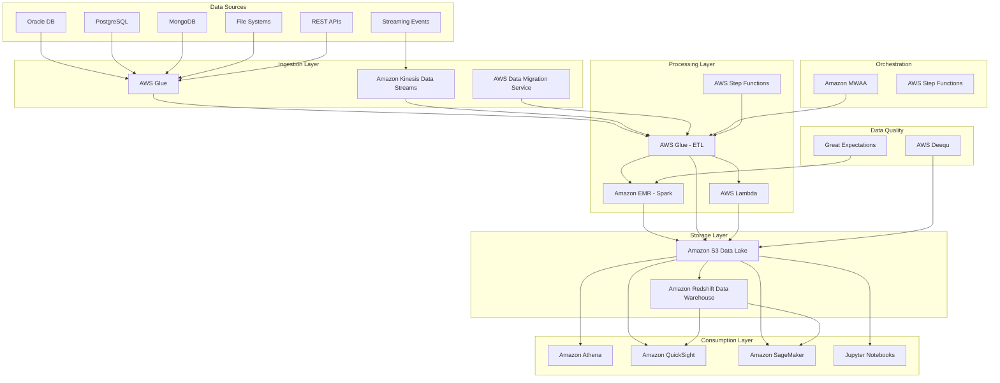
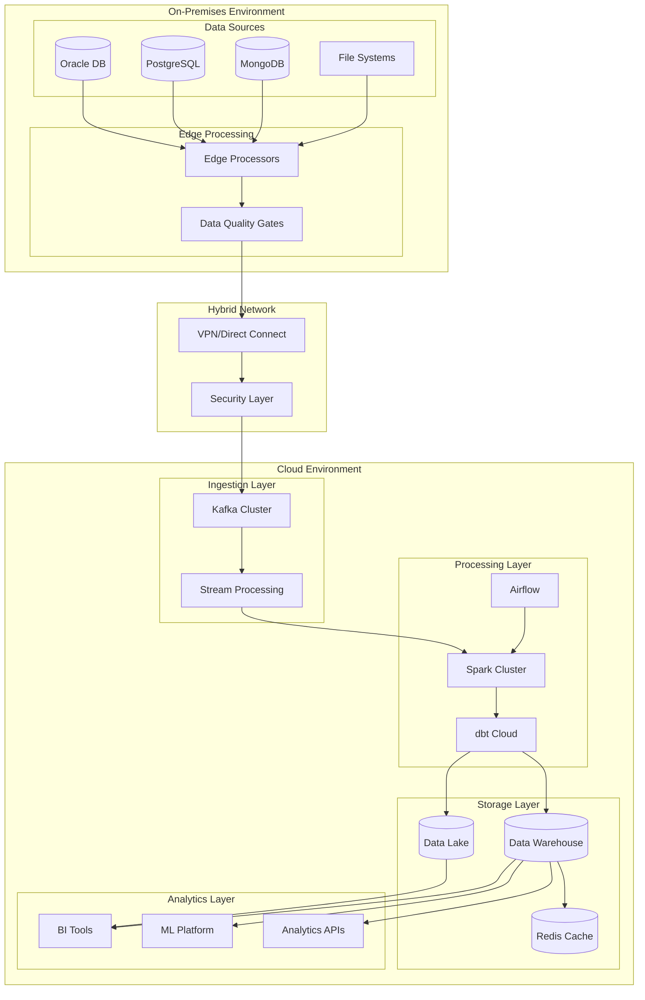
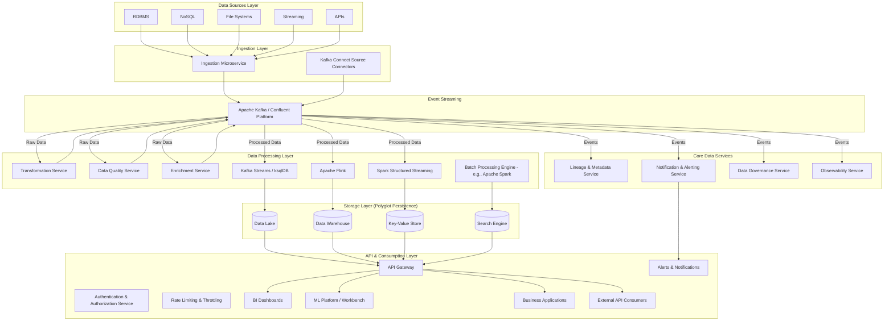
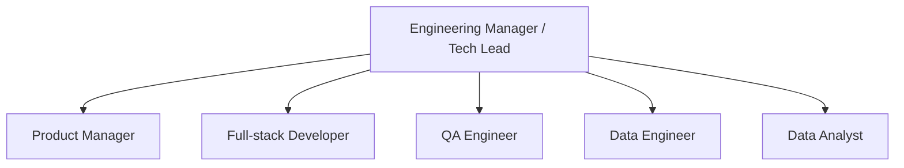

## [Recommended] Architecture Option 1: AWS-Native Data Lake with Serverless Processing

### High-Level Architecture

### Technology Stack & Process Flow
- **Cloud Platform**: AWS
- **Data Ingestion**: AWS Glue, Amazon Kinesis Data Streams, AWS Data Migration Service (DMS)
    - Data from databases, files, streams, and APIs is ingested using AWS Glue (for batch and file-based), Kinesis Data Streams (for real-time), and DMS (for database migration).
- **Data Processing**: AWS Glue (ETL), Amazon EMR (Spark), AWS Lambda, AWS Step Functions
    - AWS Glue ETL jobs and Amazon EMR (Spark) transform, clean, and enrich the data. Glue handles most ETL, while EMR is used for large-scale distributed analytics.
- **Orchestration**: AWS Step Functions, Amazon Managed Workflows for Apache Airflow (MWAA)
    - AWS Step Functions and MWAA coordinate ETL workflows, manage dependencies, and schedule jobs.
- **Data Quality**: AWS Deequ, Great Expectations (on EMR)
    - AWS Deequ and Great Expectations validate data quality, applying rules and checks before data is loaded into storage.
- **Data Storage**: Amazon S3 (Data Lake), Amazon Redshift (Data Warehouse)
    - Transformed data is stored in Amazon S3 (data lake) and Amazon Redshift (data warehouse) for analytics and reporting.
- **Consumption**: Amazon QuickSight, Jupyter Notebooks (on SageMaker), Amazon SageMaker, Amazon Athena
    - Data is accessed by analytics tools (Athena, QuickSight), data science platforms (SageMaker, Jupyter), and BI dashboards. S3 is the central hub for downstream consumption.

### Pros:
- **Scalability**: Auto-scaling serverless AWS components handle variable workloads efficiently
- **Cost-Effective**: Pay-per-use model reduces operational costs
- **Modern Stack**: AWS-native tools with excellent ecosystem support
- **Flexibility**: Supports all data types and processing patterns
- **Maintenance**: Managed AWS services reduce operational overhead

### Cons:
- **Vendor Lock-in**: Heavy reliance on AWS services
- **Complexity**: Multiple AWS tools require specialized expertise
- **Cost Unpredictability**: Usage-based pricing can be hard to forecast
- **Data Transfer Costs**: Moving large volumes between AWS services can be expensive

---

## Architecture Option 2: Hybrid On-Premises and Cloud Architecture

### High-Level Architecture

### Technology Stack & Process Flow
- **On-Premises**: Traditional databases, local file systems
- **Edge Processing**: Apache NiFi, Talend Data Integration
    - Data is collected from local databases and file systems. Edge processors and data quality gates (e.g., Apache NiFi, Talend) perform initial filtering, validation, and transformation close to the source.
- **Hybrid Connectivity**: AWS Direct Connect, Azure ExpressRoute
    - Data is securely transferred to the cloud via VPN or Direct Connect, passing through a security layer for encryption and compliance.
- **Cloud Processing**: Managed Kafka, Databricks, Snowflake
    - In the cloud, data enters a Kafka cluster for scalable, real-time ingestion. Stream processing frameworks further refine and route data. Spark clusters and dbt Cloud perform advanced transformations, aggregations, and modeling. Airflow orchestrates these workflows.
- **Security**: Enterprise security tools, encryption in transit/rest
- **Storage**: Data Lake, Data Warehouse, Redis Cache
    - Processed data is stored in a cloud data lake and data warehouse, with Redis cache for fast access to frequently used data.
- **Analytics & Consumption**: BI tools, ML platforms, Analytics APIs
    - BI tools, ML platforms, and APIs access the data for reporting, analytics, and machine learning. Data warehouse and lake serve as sources for dashboards and applications.

### Pros:
- **Compliance**: Sensitive data can remain on-premises
- **Gradual Migration**: Phased approach to cloud adoption
- **Cost Control**: Leverage existing on-premises investments
- **Performance**: Reduced latency for local data processing
- **Security**: Enhanced control over sensitive data

### Cons:
- **Complexity**: Managing hybrid infrastructure is challenging
- **Latency**: Network latency between on-premises and cloud
- **Maintenance**: Higher operational overhead
- **Scaling Limitations**: On-premises components may become bottlenecks
- **Integration Complexity**: Multiple environments to synchronize

---

## Architecture Option 3: Event-Driven Microservices Data Platform

### High-Level Architecture

### Technology Stack & Process Flow

#### 1. **Data Ingestion**
- **Direct Ingestion by Microservice**:
    - Handles data from RDBMS, NoSQL, file systems, and APIs requiring custom logic.
    - Securely connects to sources, extracts data, and publishes events to raw Kafka topics.
- **Kafka Connect**:
    - Utilized for CDC from databases and bulk file loads.
    - Streams data directly into Kafka topics with robust, fault-tolerant connectors.
- **Direct Streaming Sources**:
    - Native streaming sources publish event streams directly to Kafka.

#### 2. **Event Streaming Backbone**
- **Apache Kafka / Confluent Platform**:
    - Central nervous system for event persistence, decoupling producers/consumers, replayability, and historical analysis.
    - *Schema Enforcement*: Data adheres to schemas managed by a Schema Registry for compatibility and contract enforcement.

#### 3. **Data Processing**
- **Stream-Native Microservices**:
    - **Transformation Service**: Cleans, normalizes, and transforms raw events, publishing to new Kafka topics.
    - **Data Quality Service**: Validates data, logs metrics, and routes failed records to error topics.
    - **Enrichment Service**: Joins events with external reference data, publishing enriched data.
- **Real-time Stream Processing**:
    - **Kafka Streams / ksqlDB**: Lightweight, real-time filtering, aggregations, and routing.
    - **Apache Flink**: Complex event processing, stateful computations, advanced analytics.
    - **Spark Structured Streaming**: Near-real-time processing for advanced analytics and ML.
- **Batch Processing**:
    - **Batch Processing Engine (e.g., Apache Spark)**: Large-scale historical analysis, aggregations, and ML model training.

#### 4. **Core Data Services**
- **Lineage & Metadata Service**: Tracks data flow, transformations, and dependencies for governance and debugging.
- **Notification & Alerting Service**: Triggers automated alerts for data quality issues and system health.
- **Data Governance Service**: Manages policies, access controls, retention, and compliance.
- **Observability Service**: Centralizes logs, metrics, and traces for system health and performance.

#### 5. **Data Storage (Polyglot Persistence)**
- **Data Lake**: Stores raw, semi-structured, and processed data for analytics and ML.
- **Data Warehouse**: Houses structured, aggregated data for BI reporting.
- **Key-Value Store**: High-throughput, low-latency access for operational lookups and caching.
- **Search Engine**: Indexes data for full-text search and analytical dashboards.

#### 6. **API & Consumption Layer**
- **API Gateway**: Unified, secure entry point for all data consumers.
    - **Authentication & Authorization Service**: Enforces access permissions.
    - **Rate Limiting & Throttling**: Protects backend services from overload.
- **Data Consumers**:
    - **BI Dashboards**: Connect to Data Warehouse for business insights.
    - **ML Platform / Workbench**: Accesses Data Lake and other storage for model development.
    - **Business Applications**: Consume processed data and services via API Gateway.
    - **External API Consumers**: Third-party access to platform data.
    - **Alerts & Notifications**: Automated outputs from Notification & Alerting Service.

### Pros
- **Highly Scalable**: Decoupled microservices and event streaming enable elastic scaling.
- **Real-Time & Batch Processing**: Supports both real-time analytics and large-scale batch jobs.
- **Polyglot Persistence**: Optimizes storage for diverse access patterns.
- **Extensible & Modular**: Easy to add new services and data sources.
- **Strong Governance & Observability**: Built-in lineage, monitoring, and alerting.

### Cons
- **Complexity**: Requires expertise in distributed systems and event-driven architectures.
- **Operational Overhead**: More moving parts to monitor and maintain.
- **Initial Setup Effort**: Higher upfront investment in architecture and tooling.
- **Integration Challenges**: Ensuring seamless interoperability between microservices and platforms.

---

## Team Organization Strategy

### Recommended Software Development Team Structure

### Team Responsibilities

- **Engineering Manager / Tech Lead**: Oversees technical direction, architecture, team coordination, and may handle DevOps responsibilities if needed.
- **Product Manager**: Defines requirements, prioritizes features, and manages stakeholder communication.
- **Full-stack Developer**: Designs and builds both frontend and backend systems, manages deployment and infrastructure (DevOps), bridges gaps between UI and data services.
- **QA Engineer**: Designs and executes test plans, ensures software quality and reliability.
- **Data Engineer**: Designs and builds ETL/ELT pipelines, data models, and ensures data quality.
- **Data Analyst**: Creates reports, dashboards, and provides insights for business users.

### Delivery Strategy

| **Phase** | **Task Description** | **T-Shirt Size** |
| --- | --- | --- |
| Foundation | Establish core infrastructure and secure development environments | L |
| Foundation | Develop initial data ingestion and processing pipelines | M |
| Foundation | Build foundational user interfaces and APIs for key business functions | M |
| Foundation | Set up automated testing frameworks and CI/CD pipelines | S |
| Foundation | Define project governance, documentation standards, and onboarding processes | S |
| Expansion | Enhance data processing and analytics capabilities | M |
| Expansion | Refine and extend user interfaces based on stakeholder feedback | S |
| Expansion | Integrate additional data sources and expand data coverage | M |
| Expansion | Implement comprehensive monitoring, alerting, and logging | S |
| Expansion | Conduct regular stakeholder reviews to align deliverables with business goals | S |
| Optimization | Optimize system performance, scalability, and cost-efficiency | M |
| Optimization | Integrate advanced analytics and machine learning models | L |
| Optimization | Deliver user training, documentation, and support resources | S |
| Optimization | Establish continuous improvement cycles | S |
| Optimization | Finalize disaster recovery, business continuity, and security protocols | M |

#### Phase 1: Foundation (Months 1-3)
- Establish core infrastructure and configure secure development environments
- Develop initial data ingestion and processing pipelines
- Build foundational user interfaces and APIs for key business functions
- Set up automated testing frameworks and CI/CD pipelines to ensure code quality and rapid delivery
- Define project governance, documentation standards, and onboarding processes

#### Phase 2: Expansion (Months 4-6)
- Enhance data processing and analytics capabilities, including advanced transformations and reporting features
- Refine and extend user interfaces based on stakeholder feedback
- Integrate additional data sources and expand data coverage
- Implement comprehensive monitoring, alerting, and logging for system reliability
- Conduct regular stakeholder reviews to align deliverables with business objectives

#### Phase 3: Optimization (Months 7-9)
- Optimize system performance, scalability, and cost-efficiency through targeted improvements
- Integrate advanced analytics and machine learning models to support predictive and prescriptive insights
- Deliver user training, documentation, and support resources to drive adoption
- Establish continuous improvement cycles, leveraging feedback and metrics for ongoing enhancement
- Finalize disaster recovery, business continuity, and security protocols

### Working with Business Stakeholders

#### Communication Strategy
- **Weekly Sprint Reviews**: Demonstrate progress to stakeholders and address immediate concerns
- **Monthly Business Reviews**: Align on priorities, requirements, and strategic direction
- **Quarterly Architecture Reviews**: Assess and adjust technical direction, validate alignment with business goals
- **Weekly Progress Emails**: Distribute concise updates to all stakeholders, including current status, key achievements, and a summary of the risk register

#### Stakeholder Management
- **Product Owners**: Regular meetings to clarify requirements, validate deliverables, and manage expectations
- **Business Analysts**: Collaborate on feature definitions, user stories, and business process mapping
- **End Users**: Conduct training sessions, gather feedback, and support adoption for continuous improvement
- **Risk Register**: Maintain and review a project risk register, highlighting new, ongoing, and mitigated risks in weekly communications

---

## Recommendation

Based on the requirements and team capabilities, I recommend **Option 1: AWS-Native Data Lake with Serverless Processing** for the following reasons:

1. **Scalability**: Best positioned to handle high-volume retail data with auto-scaling capabilities
2. **Cost-Effectiveness**: Pay-per-use model aligns with variable retail data patterns
3. **Time-to-Market**: Managed services enable faster implementation
4. **Future-Proof**: Cloud-native approach supports AI/ML initiatives
5. **Team Skills**: Easier to find talent familiar with cloud-native tools

### Implementation Considerations
- Start with a pilot using one data source and one analytics use case
- Implement robust data governance from day one
- Establish comprehensive monitoring and alerting
- Plan for disaster recovery and business continuity
- Ensure proper security controls are in place from the beginning